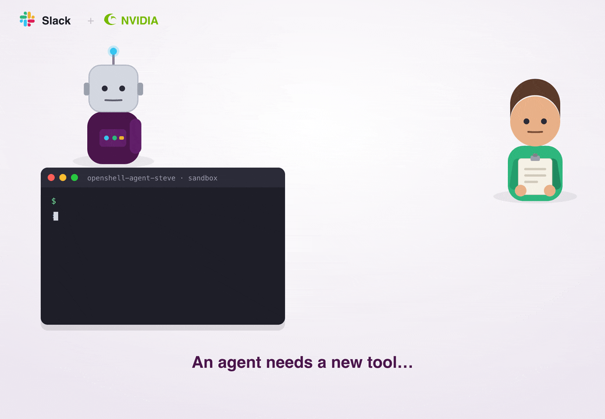

# OpenShell Slack Admin Bridge



A Slack app that brings OpenShell sandbox network-egress approvals into Slack. When a
sandboxed agent hits an egress denial, OpenShell's analysis proposes a draft network-policy
change (a "chunk"). This bridge surfaces each pending chunk as an interactive Slack message so
an admin can approve or reject it. Approvals merge into that sandbox's policy and hot-reload;
its `/wait` loop then retries. Rejections leave the sandbox denied.

Scope is network egress only. Filesystem and process policy are locked at sandbox creation and
are not proposable, so they are out of scope by design.

## How it works

```
OpenShell gateway  <--gRPC-->  Bridge  <--Socket Mode-->  Slack
   (draft chunks)              (poll + decide)            (admins)
```

1. The bridge polls `GetDraftPolicy` per sandbox (OpenShell never pushes new proposals).
2. A newly discovered pending chunk is posted to the routed channel as a Block Kit message.
3. An admin clicks Approve (with a confirm) or Reject (opens a reason modal).
4. The bridge calls `ApproveDraftChunk` (with the chunk's `review_token`) or `RejectDraftChunk`,
   then rewrites the message to a terminal state noting who decided and the new policy version.
5. Decisions made outside Slack are detected on the next poll and the message is closed.

### Key design points

- **Polling is mandatory.** The `draft_policy_update` stream field exists in the proto but is
  never emitted server-side, so discovery is by polling `GetDraftPolicy`.
- **Optimistic concurrency.** `ApproveDraftChunk` carries a `review_token`; a stale token returns
  `FAILED_PRECONDITION`. The bridge refreshes the token and retries once.
- **The bridge owns identity and message state.** OpenShell records no approver identity on the
  wire, so the bridge stores the Slack approver and the message coordinates in a durable state file
  keyed by `chunk_id` (`STATE_STORE_PATH`). This also survives restarts (startup reconciliation).
- **Single in-flight decision.** A per-chunk lock prevents two admins from double-deciding.
- **GA Block Kit only.** No card/carousel primitives.

## Setup

For a short Docker Desktop setup, see the [exporter quick start](docs/exporter-quickstart.md).
For audit ingestion from NVIDIA's Research exporter, see the
[Research exporter integration guide](docs/research-exporter.md). It covers the
pinned source build, envelope-v1 adapter, TLS/bearer setup, and a synthetic
end-to-end verification that does not post to Slack.

### 1. Slack app

Create the app from [`manifest.json`](./manifest.json): [api.slack.com/apps](https://api.slack.com/apps)
-> **Create New App** -> **From a manifest**. It is a Socket Mode app (no request URLs) and requests a
single bot scope, `chat:write`, to keep the install easy for admins to approve. It also sets the App
Home + `app_home_opened` subscription and interactivity.

After creating it, install to the workspace for the bot token (`xoxb-...`) and generate an
app-level token with `connections:write` (`xapp-...`) for Socket Mode. The bot does not self-join
channels (that would need `channels:join`), so create the approval channel, invite the bot with
`/invite @openshell_admin`, and put the channel ID in `config/admins.yaml`. Full steps, including
connecting to a real gateway, are in [docs/03-deployment.md](./docs/03-deployment.md).

### 2. Configure

```bash
cp .env.example .env
cp config/admins.example.yaml config/admins.yaml
```

Edit `.env` (Slack tokens, gateway URL, auth mode) and `config/admins.yaml` (admin allow-list and
channel routing). Never commit `.env` or `config/admins.yaml`.

Auth modes:

- `mtls` (single-host default): point `OPENSHELL_CA_CERT` / `OPENSHELL_CLIENT_CERT` /
  `OPENSHELL_CLIENT_KEY` at the install bundle under `~/.config/openshell/gateways/openshell/mtls/`.
- `bearer` (Docker/Helm/K8s): set `OPENSHELL_BEARER_TOKEN` or `OPENSHELL_BEARER_TOKEN_FILE`.

### 3. Run

```bash
npm install
npm run dev          # watch mode against a real gateway
npm start            # compiled (after npm run build)
```

## Local testing with the mock gateway

The mock implements the OpenShell RPC subset in memory (seeded sandbox + pending chunks, honoring
`review_token`).

```bash
# Terminal 1: mock gateway (insecure loopback)
npm run dev:mock

# Terminal 2: bridge pointed at the mock
#   set these in .env first:
#   OPENSHELL_GATEWAY_URL=127.0.0.1:17670
#   OPENSHELL_USE_TLS=false
npm run dev
```

The mock seeds two pending chunks and injects a late proposal ~12s after start so you can watch
the poller pick it up. `scripts/run-mock.ts` is a variant that seeds a single pending chunk with no
late injection, useful for driving one card at a time.

## Audit event capture

Alongside the approval bridge, an optional **audit sink** streams OpenShell's OCSF audit
events into a private Slack channel as a searchable firehose. It runs as a separate process
(`npm run start:capture`, or `npm run dev:capture` in watch mode), independent of the
approve/reject bridge: it shares only config loading, never touches the gRPC decision path, and
its only outward call is `chat.postMessage` to a dedicated audit channel. By design it does no
dedup, so an approval-outcome event that also shows up here is acceptable.

Enable it by setting `CAPTURE_SOURCES` (comma-separated; empty = off) and a
`routing.audit_channel` in the YAML that differs from every approval channel. Invite the bot to
that channel (it holds only `chat:write` and cannot self-join).

- `file` - tail the OCSF JSONL file OpenShell writes locally (the native path). Set
  `CAPTURE_FILE_PATH` (a glob is fine for daily-rotated logs); byte offsets persist to
  `CAPTURE_FILE_OFFSET_STATE` so a restart resumes without replaying the backlog.
- `http` - run an inbound receiver for an external log-shipper (Filebeat, Vector, Fluent Bit) to
  POST to. Set `CAPTURE_RECEIVER_TOKEN` (a shared bearer the receiver requires) and optionally
  `CAPTURE_RECEIVER_BIND` (default `0.0.0.0:8090`). The body is NDJSON of bare OCSF objects by
  default; a JSON array or a CloudEvents envelope is also accepted. Set
  `CAPTURE_RECEIVER_TLS_CERT` + `CAPTURE_RECEIVER_TLS_KEY` to serve HTTPS.

To silence specific noise, set `capture.exclude_event_types` in the YAML (exact,
case-insensitive match on the OCSF class or type name); the default captures everything. Posts
flow through a bounded, rate-limited queue that applies backpressure (HTTP 503 + Retry-After on
the receiver) rather than dropping under load. See
[docs/04-testing-runbook.md](./docs/04-testing-runbook.md) Step 9 for an agent-runnable capture test.

## App Home dashboard

The bridge also publishes an **App Home** tab for admins, refreshed on `app_home_opened`: the
pending-approval queue rendered as action cards plus a native chart of recent decision activity,
with cards deep-linking to the original request message. The Home view uses newer Block Kit
primitives (an action-card carousel and `data_visualization` charts); if `views.publish` rejects
them, the bridge retries once with a GA-only fallback so the tab is never left blank. This is
part of the approval bridge (`src/index.ts` -> `src/app-home.ts`), not the audit sink.

## Tests

```bash
npm test        # unit + a real-socket gRPC integration test against the mock
npm run typecheck
```

For a full end-to-end, agent-runnable integration runbook (install OpenShell -> produce a real
pending chunk -> decide -> capture an audit event), see
[docs/04-testing-runbook.md](./docs/04-testing-runbook.md).

## Layout

| Path | Responsibility |
| --- | --- |
| `src/config.ts` | Env + YAML config, admin allow-list, role gating, channel routing |
| `src/openshell-client.ts` | gRPC client, wire types, mTLS/bearer credentials |
| `src/state-store.ts` | Durable `chunk_id`-keyed store (coords, review_token, lock, terminal status) |
| `src/action-request.ts` | Normalizes a `PolicyChunk` into a display-ready request |
| `src/slack-messages.ts` | GA Block Kit builders and the reject modal |
| `src/app-home.ts` | App Home dashboard view |
| `src/poller.ts` | Discovery loop; emits `chunk_new` / `chunk_closed` |
| `src/index.ts` | Bolt wiring, decision handlers, startup reconciliation |
| `src/capture-main.ts` | Audit sink entrypoint: standalone, post-only capture process (`start:capture`) |
| `src/capture/` | OCSF ingest (file tail + HTTP receiver), normalize/filter/render, bounded send queue |
| `src/mock-server.ts` | In-memory OpenShell gateway for local testing |
| `proto/` | OpenShell protobuf definitions |

## Licensing

This sample is released under the [MIT License](./LICENSE).

The Protocol Buffer definitions under [`proto/`](./proto) are part of NVIDIA's
[OpenShell](https://github.com/NVIDIA/OpenShell) project and are licensed under
Apache-2.0, not MIT. See [`proto/NOTICE`](./proto/NOTICE) for details.
